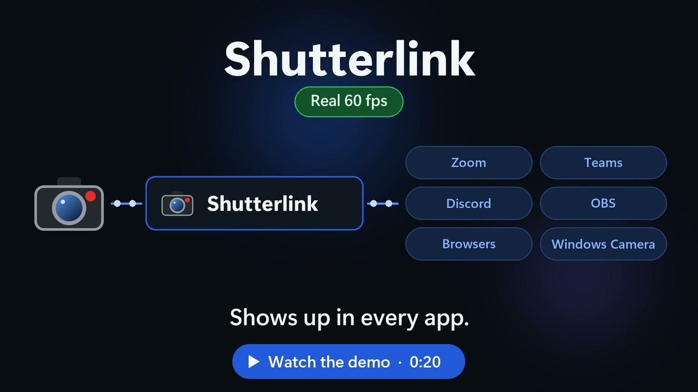
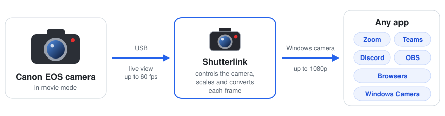
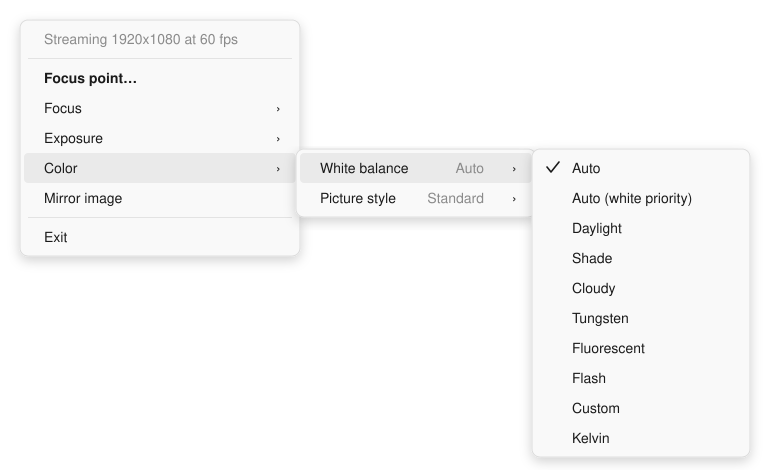
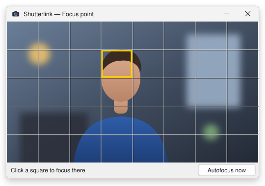

  

<h1 align="center">Shutterlink</h1>

  <b>Your Canon camera is the best webcam you own.</b> 
  One USB cable, 60 fps, no subscription — it shows up in every app as a normal camera.

  
  
  
  
  

  <a href="#features">Features</a> ·
  <a href="#install">Install</a> ·
  <a href="docs/USER-GUIDE.md">User guide</a> ·
  <a href="docs/LIMITATIONS.md">Limitations</a> ·
  <a href="docs/DEVELOPMENT.md">Build from source</a> ·
  <a href="https://ko-fi.com/mmannai">Support</a>

  

  

---

## Why Shutterlink

- **Real 60 fps.** Every frame is a new one from the camera — no duplicated or interpolated frames.
- **No subscription, no capture card.** One USB cable. Free and open source, for good.
- **Works everywhere.** Shutterlink registers a standard Windows 11 camera, so Zoom, Teams, Discord, OBS, Chrome,
  Edge and the Camera app all see it — nothing to configure per app.
- **Your camera's controls, on your PC.** Focus, exposure and color from the taskbar, and click-to-focus from a live
  preview.

## Features

<table>
  <tr>
    <td width="50%" valign="top">
      
      <h3>Camera controls in the taskbar</h3>
      Autofocus, continuous AF, AF method, manual focus steps, ISO, shutter speed, aperture, exposure compensation,
      white balance, Kelvin temperature and picture style. The menu lists exactly what your camera allows in its
      current mode. <a href="docs/USER-GUIDE.md#the-tray-menu">Learn more</a>
    </td>
    <td width="50%" valign="top">
      
      <h3>Click to focus</h3>
      A small always-on-top preview with a grid. Click a square and the camera moves its autofocus point there — the
      same touch-to-focus as on the camera's screen. <a href="docs/USER-GUIDE.md#focus-point-window">Learn more</a>
    </td>
  </tr>
</table>

**Also included:**
1080p, 720p, 576p and 360p formats at 60 or 30 fps ·
mirror image ·
keeps the camera awake during calls ·
the camera is only switched to PC live view while an app is actually using it ·
reconnects automatically when the camera is turned back on ·
starts quietly with Windows.

## Install

Shutterlink runs on **Windows 11** (64-bit). It is developed and tested with the **Canon EOS R6**; other EOS bodies
that support live view over USB will probably work — see [camera compatibility](docs/LIMITATIONS.md#camera-compatibility).

1. Download **[Shutterlink.exe](https://github.com/Mannai/Shutterlink/releases/latest/download/Shutterlink.exe)**
   from the latest release.
2. Double-click it and choose **Yes** to install. Windows asks for administrator permission once.
3. Connect the camera with a USB cable, set it to **movie mode**, turn it on — and pick **Shutterlink** as the
   camera in your app.

Shutterlink installs to `C:\Program Files\Shutterlink`, registers the camera with Windows and starts at sign-in. To
update, run a newer `Shutterlink.exe` the same way. To uninstall, open **Settings ▸ Apps ▸ Installed apps**, find
**Shutterlink** and choose **Uninstall**.

The release is not code-signed, so Windows SmartScreen may warn the first time; choose **More info ▸ Run anyway**, or
[build it yourself](docs/DEVELOPMENT.md). Every release is built by GitHub Actions straight from the tagged source.

> **For 60 fps**, set the camera's movie recording size to **1920×1080 59.94p** and use a **USB 3** cable.
> More camera tips are in the [user guide](docs/USER-GUIDE.md#camera-setup).

## Documentation

| | |
|---|---|
| **Using Shutterlink** | [Camera setup](docs/USER-GUIDE.md#camera-setup) · [The tray menu](docs/USER-GUIDE.md#the-tray-menu) · [Focus point window](docs/USER-GUIDE.md#focus-point-window) · [Troubleshooting](docs/USER-GUIDE.md#troubleshooting) |
| **Good to know** | [Known limitations](docs/LIMITATIONS.md) · [Camera compatibility](docs/LIMITATIONS.md#camera-compatibility) |
| **Developers** | [How it works](docs/DEVELOPMENT.md#how-it-works) · [Build and package](docs/DEVELOPMENT.md#building) · [Diagnostic tools](docs/DEVELOPMENT.md#diagnostic-tools) · [Camera protocol notes](docs/DEVELOPMENT.md#camera-protocol) |

## Status

Shutterlink is young: it has been built and tested end to end with an EOS R6 on Windows 11, and everything else is
listed honestly in [Known limitations](docs/LIMITATIONS.md). Reports from other cameras are very welcome — please
[open an issue](https://github.com/Mannai/Shutterlink/issues) with your camera model and what worked.

## Support

Shutterlink is free and always will be. If it saved you a subscription or a capture card, you can
[buy me a coffee on Ko-fi](https://ko-fi.com/mmannai) ☕

## License

Copyright © 2026 Mannai. Shutterlink is **free and open-source software** under the
[GNU General Public License v3.0](LICENSE) (or any later version).

| | |
|---|---|
| Use Shutterlink at home, at work or in a business | Allowed |
| Read, change and build the code | Allowed |
| Share copies, changed or not | Allowed — under the same license, with the source code |
| Make a closed-source product from it | Not allowed |

Canon's USB camera protocol is not publicly documented. Shutterlink builds on protocol knowledge published by the
[libgphoto2](https://github.com/gphoto/libgphoto2) project and on Julian Schroden's write-up of
[remote live view on Canon EOS cameras](https://julianschroden.com/post/2023-08-19-remote-live-view-using-ptp-ip-on-canon-eos-cameras/).
No code from either is included.

Shutterlink is an independent project. It is not affiliated with, endorsed by or sponsored by Canon Inc. Canon
and EOS are trademarks of Canon Inc.
